# FastSVERL Explanations for Mastermind

This document presents qualitative examples of Shapley value explanations generated using FastSVERL for trained DQN agents in various Mastermind domains.

Mastermind is a code-breaking game where, in these versions, an agent must guess a hidden 4-letter code, drawn from a 3-letter alphabet, within a limited number of turns. After each guess, the agent receives two clues: *Clue 2* for the number of correct letters in the correct position, and *Clue 1* for the number of correct letters in the wrong position. Full details of gameplay are provided in the paper.

## How to Read the Visualisations

For each state, three explanation types are shown side-by-side: *Behaviour*, *Performance*, and *Prediction*. The colour of each cell on the board represents its relative Shapley value, which indicates the feature's contribution to the explanation type. **For clarity, the Shapley values in all figures are normalised to sit between -1 and 1.**

* *Blue* cells indicate a *positive* contribution.
* *Red* cells indicate a *negative* contribution.
* The *intensity* of the colour corresponds to the magnitude of the influence.
* For the *Behaviour* explanation, the agent's next chosen action is marked in *green* for reference.

Full details of the FastSVERL methodology are available in the main paper.

### A Note on On-Policy Explanations

Figures for the *on-policy outcome explanations* are not presented in this README, though they are stored in the image folders. We have omitted them because the on-policy explanations were found to be erratic, suggesting potential instability as the domains scale. Investigating this is an important avenue for future work.

## Navigating This Document

This document is organised by domain size. A table of contents at the top provides direct links to each domain section. Within each section, a grid of links allows you to jump to a specific state.

Please note that the state indices are for navigational purposes only and do not represent a sequential trajectory. The states presented are representative of those encountered by an approximately optimal policy in each domain.

## Experimental Domains
* [Mastermind-443](#mastermind-443)
* [Mastermind-453](#mastermind-453)
* [Mastermind-463](#mastermind-463)

 

---
## Mastermind-443

### Jump to State
|   |   |   |   |   |   |   |   |   |   |
|---|---|---|---|---|---|---|---|---|---|
| [1](#state-1-mastermind-443) | [2](#state-2-mastermind-443) | [3](#state-3-mastermind-443) | [4](#state-4-mastermind-443) | [5](#state-5-mastermind-443) | [6](#state-6-mastermind-443) | [7](#state-7-mastermind-443) | [8](#state-8-mastermind-443) | [9](#state-9-mastermind-443) | [10](#state-10-mastermind-443) |
| [11](#state-11-mastermind-443) | [12](#state-12-mastermind-443) | [13](#state-13-mastermind-443) | [14](#state-14-mastermind-443) | [15](#state-15-mastermind-443) | [16](#state-16-mastermind-443) | [17](#state-17-mastermind-443) | [18](#state-18-mastermind-443) | [19](#state-19-mastermind-443) | [20](#state-20-mastermind-443) |
| [21](#state-21-mastermind-443) | [22](#state-22-mastermind-443) | [23](#state-23-mastermind-443) | [24](#state-24-mastermind-443) | [25](#state-25-mastermind-443) | [26](#state-26-mastermind-443) | [27](#state-27-mastermind-443) | [28](#state-28-mastermind-443) | [29](#state-29-mastermind-443) | [30](#state-30-mastermind-443) |
| [31](#state-31-mastermind-443) | [32](#state-32-mastermind-443) | [33](#state-33-mastermind-443) | [34](#state-34-mastermind-443) | [35](#state-35-mastermind-443) | [36](#state-36-mastermind-443) | [37](#state-37-mastermind-443) | [38](#state-38-mastermind-443) | [39](#state-39-mastermind-443) | [40](#state-40-mastermind-443) |
| [41](#state-41-mastermind-443) | [42](#state-42-mastermind-443) | [43](#state-43-mastermind-443) | [44](#state-44-mastermind-443) | [45](#state-45-mastermind-443) | [46](#state-46-mastermind-443) | [47](#state-47-mastermind-443) | [48](#state-48-mastermind-443) | [49](#state-49-mastermind-443) | [50](#state-50-mastermind-443) |
| [51](#state-51-mastermind-443) | [52](#state-52-mastermind-443) | [53](#state-53-mastermind-443) | [54](#state-54-mastermind-443) | [55](#state-55-mastermind-443) | [56](#state-56-mastermind-443) | [57](#state-57-mastermind-443) | [58](#state-58-mastermind-443) | [59](#state-59-mastermind-443) | [60](#state-60-mastermind-443) |
| [61](#state-61-mastermind-443) | [62](#state-62-mastermind-443) | [63](#state-63-mastermind-443) | [64](#state-64-mastermind-443) | [65](#state-65-mastermind-443) | [66](#state-66-mastermind-443) | [67](#state-67-mastermind-443) | [68](#state-68-mastermind-443) | [69](#state-69-mastermind-443) | [70](#state-70-mastermind-443) |
| [71](#state-71-mastermind-443) | [72](#state-72-mastermind-443) | [73](#state-73-mastermind-443) | [74](#state-74-mastermind-443) | [75](#state-75-mastermind-443) |   |   |   |   |   |

---
<h3 id='state-1-mastermind-443'>State 1</h3>
<table>
<tr>
<td valign="top" align="center">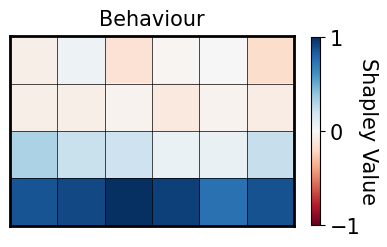</td>
<td valign="top" align="center">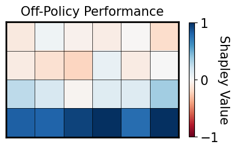</td>
<td valign="top" align="center">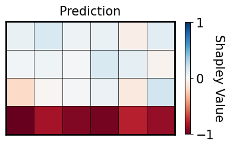</td>
</tr>
</table>

---
<h3 id='state-2-mastermind-443'>State 2</h3>
<table>
<tr>
<td valign="top" align="center">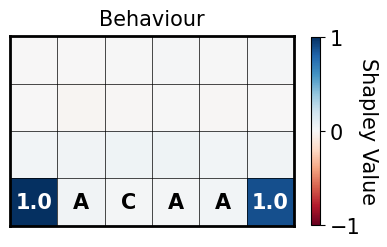</td>
<td valign="top" align="center">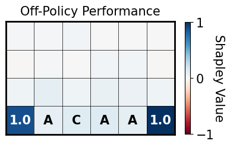</td>
<td valign="top" align="center">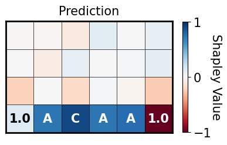</td>
</tr>
</table>

---
<h3 id='state-3-mastermind-443'>State 3</h3>
<table>
<tr>
<td valign="top" align="center">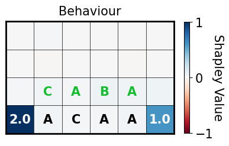</td>
<td valign="top" align="center">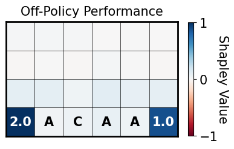</td>
<td valign="top" align="center">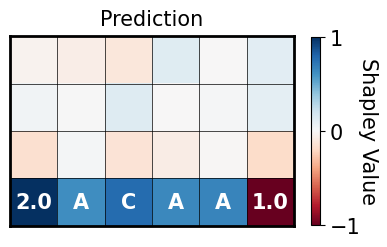</td>
</tr>
</table>

---
<h3 id='state-4-mastermind-443'>State 4</h3>
<table>
<tr>
<td valign="top" align="center">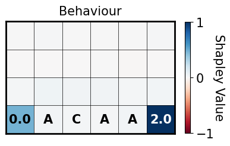</td>
<td valign="top" align="center"></td>
<td valign="top" align="center">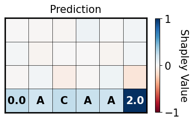</td>
</tr>
</table>

---
<h3 id='state-5-mastermind-443'>State 5</h3>
<table>
<tr>
<td valign="top" align="center">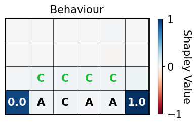</td>
<td valign="top" align="center">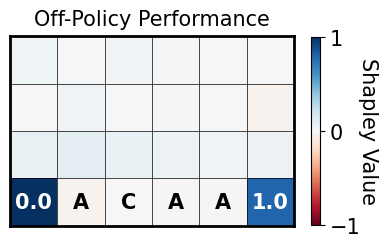</td>
<td valign="top" align="center">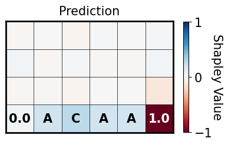</td>
</tr>
</table>

---
<h3 id='state-6-mastermind-443'>State 6</h3>
<table>
<tr>
<td valign="top" align="center">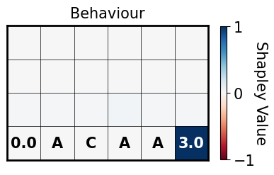</td>
<td valign="top" align="center">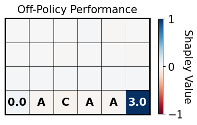</td>
<td valign="top" align="center">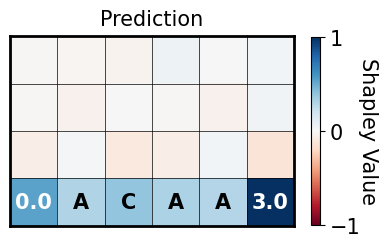</td>
</tr>
</table>

---
<h3 id='state-7-mastermind-443'>State 7</h3>
<table>
<tr>
<td valign="top" align="center">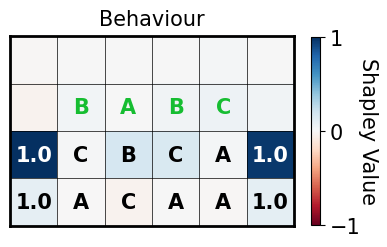</td>
<td valign="top" align="center">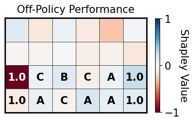</td>
<td valign="top" align="center">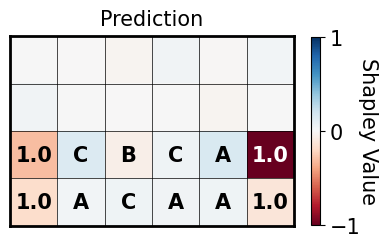</td>
</tr>
</table>

---
<h3 id='state-8-mastermind-443'>State 8</h3>
<table>
<tr>
<td valign="top" align="center">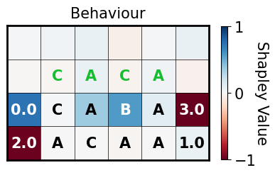</td>
<td valign="top" align="center">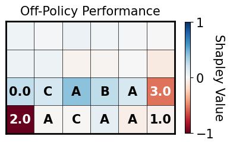</td>
<td valign="top" align="center">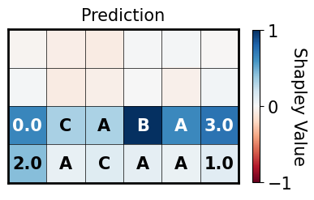</td>
</tr>
</table>

---
<h3 id='state-9-mastermind-443'>State 9</h3>
<table>
<tr>
<td valign="top" align="center">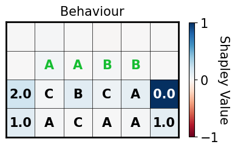</td>
<td valign="top" align="center">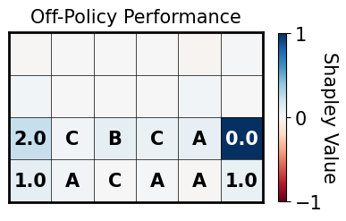</td>
<td valign="top" align="center">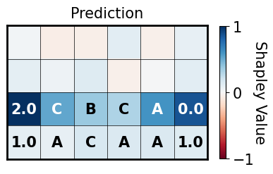</td>
</tr>
</table>

---
<h3 id='state-10-mastermind-443'>State 10</h3>
<table>
<tr>
<td valign="top" align="center">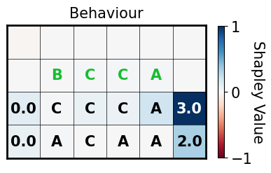</td>
<td valign="top" align="center"></td>
<td valign="top" align="center">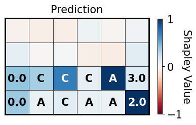</td>
</tr>
</table>

---
<h3 id='state-11-mastermind-443'>State 11</h3>
<table>
<tr>
<td valign="top" align="center">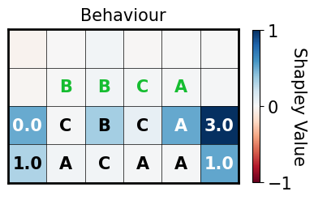</td>
<td valign="top" align="center">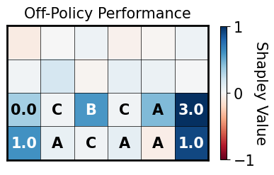</td>
<td valign="top" align="center">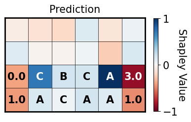</td>
</tr>
</table>

---
<h3 id='state-12-mastermind-443'>State 12</h3>
<table>
<tr>
<td valign="top" align="center">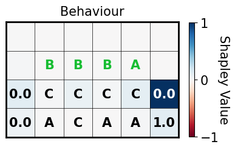</td>
<td valign="top" align="center">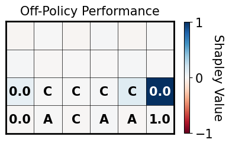</td>
<td valign="top" align="center">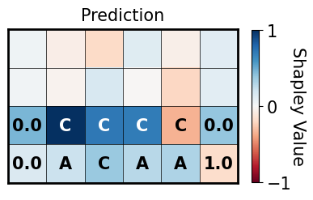</td>
</tr>
</table>

---
<h3 id='state-13-mastermind-443'>State 13</h3>
<table>
<tr>
<td valign="top" align="center"></td>
<td valign="top" align="center">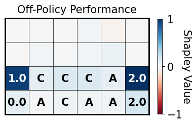</td>
<td valign="top" align="center">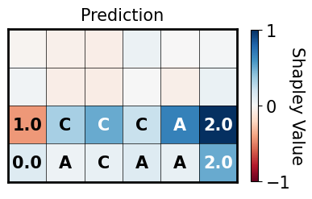</td>
</tr>
</table>

---
<h3 id='state-14-mastermind-443'>State 14</h3>
<table>
<tr>
<td valign="top" align="center">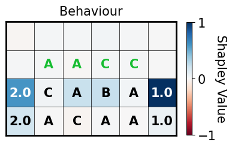</td>
<td valign="top" align="center">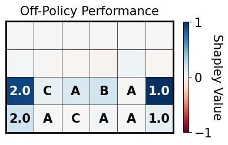</td>
<td valign="top" align="center">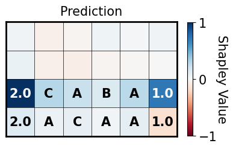</td>
</tr>
</table>

---
<h3 id='state-15-mastermind-443'>State 15</h3>
<table>
<tr>
<td valign="top" align="center">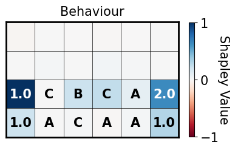</td>
<td valign="top" align="center">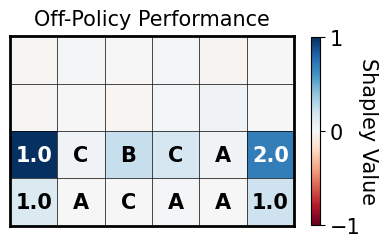</td>
<td valign="top" align="center">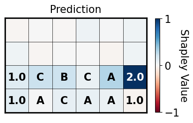</td>
</tr>
</table>

---
<h3 id='state-16-mastermind-443'>State 16</h3>
<table>
<tr>
<td valign="top" align="center">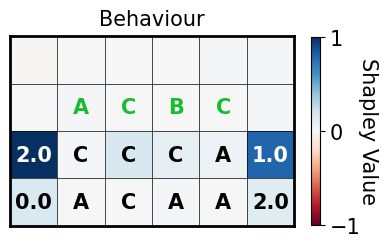</td>
<td valign="top" align="center">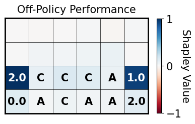</td>
<td valign="top" align="center">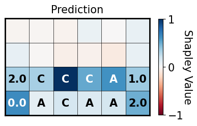</td>
</tr>
</table>

---
<h3 id='state-17-mastermind-443'>State 17</h3>
<table>
<tr>
<td valign="top" align="center">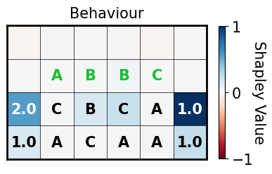</td>
<td valign="top" align="center">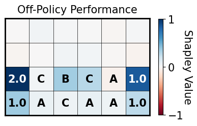</td>
<td valign="top" align="center">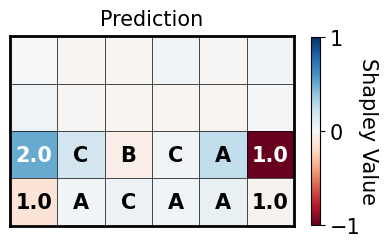</td>
</tr>
</table>

---
<h3 id='state-18-mastermind-443'>State 18</h3>
<table>
<tr>
<td valign="top" align="center">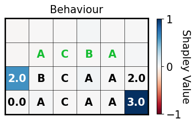</td>
<td valign="top" align="center">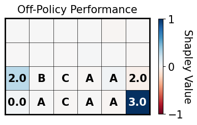</td>
<td valign="top" align="center"></td>
</tr>
</table>

---
<h3 id='state-19-mastermind-443'>State 19</h3>
<table>
<tr>
<td valign="top" align="center"></td>
<td valign="top" align="center"></td>
<td valign="top" align="center"></td>
</tr>
</table>

---
<h3 id='state-20-mastermind-443'>State 20</h3>
<table>
<tr>
<td valign="top" align="center"></td>
<td valign="top" align="center"></td>
<td valign="top" align="center"></td>
</tr>
</table>

---
<h3 id='state-21-mastermind-443'>State 21</h3>
<table>
<tr>
<td valign="top" align="center"></td>
<td valign="top" align="center"></td>
<td valign="top" align="center"></td>
</tr>
</table>

---
<h3 id='state-22-mastermind-443'>State 22</h3>
<table>
<tr>
<td valign="top" align="center"></td>
<td valign="top" align="center"></td>
<td valign="top" align="center"></td>
</tr>
</table>

---
<h3 id='state-23-mastermind-443'>State 23</h3>
<table>
<tr>
<td valign="top" align="center"></td>
<td valign="top" align="center"></td>
<td valign="top" align="center"></td>
</tr>
</table>

---
<h3 id='state-24-mastermind-443'>State 24</h3>
<table>
<tr>
<td valign="top" align="center"></td>
<td valign="top" align="center"></td>
<td valign="top" align="center"></td>
</tr>
</table>

---
<h3 id='state-25-mastermind-443'>State 25</h3>
<table>
<tr>
<td valign="top" align="center"></td>
<td valign="top" align="center"></td>
<td valign="top" align="center"></td>
</tr>
</table>

---
<h3 id='state-26-mastermind-443'>State 26</h3>
<table>
<tr>
<td valign="top" align="center"></td>
<td valign="top" align="center"></td>
<td valign="top" align="center"></td>
</tr>
</table>

---
<h3 id='state-27-mastermind-443'>State 27</h3>
<table>
<tr>
<td valign="top" align="center"></td>
<td valign="top" align="center"></td>
<td valign="top" align="center"></td>
</tr>
</table>

---
<h3 id='state-28-mastermind-443'>State 28</h3>
<table>
<tr>
<td valign="top" align="center"></td>
<td valign="top" align="center"></td>
<td valign="top" align="center"></td>
</tr>
</table>

---
<h3 id='state-29-mastermind-443'>State 29</h3>
<table>
<tr>
<td valign="top" align="center"></td>
<td valign="top" align="center"></td>
<td valign="top" align="center"></td>
</tr>
</table>

---
<h3 id='state-30-mastermind-443'>State 30</h3>
<table>
<tr>
<td valign="top" align="center"></td>
<td valign="top" align="center"></td>
<td valign="top" align="center"></td>
</tr>
</table>

---
<h3 id='state-31-mastermind-443'>State 31</h3>
<table>
<tr>
<td valign="top" align="center"></td>
<td valign="top" align="center"></td>
<td valign="top" align="center"></td>
</tr>
</table>

---
<h3 id='state-32-mastermind-443'>State 32</h3>
<table>
<tr>
<td valign="top" align="center"></td>
<td valign="top" align="center"></td>
<td valign="top" align="center"></td>
</tr>
</table>

---
<h3 id='state-33-mastermind-443'>State 33</h3>
<table>
<tr>
<td valign="top" align="center"></td>
<td valign="top" align="center"></td>
<td valign="top" align="center"></td>
</tr>
</table>

---
<h3 id='state-34-mastermind-443'>State 34</h3>
<table>
<tr>
<td valign="top" align="center"></td>
<td valign="top" align="center"></td>
<td valign="top" align="center"></td>
</tr>
</table>

---
<h3 id='state-35-mastermind-443'>State 35</h3>
<table>
<tr>
<td valign="top" align="center"></td>
<td valign="top" align="center"></td>
<td valign="top" align="center"></td>
</tr>
</table>

---
<h3 id='state-36-mastermind-443'>State 36</h3>
<table>
<tr>
<td valign="top" align="center"></td>
<td valign="top" align="center"></td>
<td valign="top" align="center"></td>
</tr>
</table>

---
<h3 id='state-37-mastermind-443'>State 37</h3>
<table>
<tr>
<td valign="top" align="center"></td>
<td valign="top" align="center"></td>
<td valign="top" align="center"></td>
</tr>
</table>

---
<h3 id='state-38-mastermind-443'>State 38</h3>
<table>
<tr>
<td valign="top" align="center"></td>
<td valign="top" align="center"></td>
<td valign="top" align="center"></td>
</tr>
</table>

---
<h3 id='state-39-mastermind-443'>State 39</h3>
<table>
<tr>
<td valign="top" align="center"></td>
<td valign="top" align="center"></td>
<td valign="top" align="center"></td>
</tr>
</table>

---
<h3 id='state-40-mastermind-443'>State 40</h3>
<table>
<tr>
<td valign="top" align="center"></td>
<td valign="top" align="center"></td>
<td valign="top" align="center"></td>
</tr>
</table>

---
<h3 id='state-41-mastermind-443'>State 41</h3>
<table>
<tr>
<td valign="top" align="center"></td>
<td valign="top" align="center"></td>
<td valign="top" align="center"></td>
</tr>
</table>

---
<h3 id='state-42-mastermind-443'>State 42</h3>
<table>
<tr>
<td valign="top" align="center"></td>
<td valign="top" align="center"></td>
<td valign="top" align="center"></td>
</tr>
</table>

---
<h3 id='state-43-mastermind-443'>State 43</h3>
<table>
<tr>
<td valign="top" align="center"></td>
<td valign="top" align="center"></td>
<td valign="top" align="center"></td>
</tr>
</table>

---
<h3 id='state-44-mastermind-443'>State 44</h3>
<table>
<tr>
<td valign="top" align="center"></td>
<td valign="top" align="center"></td>
<td valign="top" align="center"></td>
</tr>
</table>

---
<h3 id='state-45-mastermind-443'>State 45</h3>
<table>
<tr>
<td valign="top" align="center"></td>
<td valign="top" align="center"></td>
<td valign="top" align="center"></td>
</tr>
</table>

---
<h3 id='state-46-mastermind-443'>State 46</h3>
<table>
<tr>
<td valign="top" align="center"></td>
<td valign="top" align="center"></td>
<td valign="top" align="center"></td>
</tr>
</table>

---
<h3 id='state-47-mastermind-443'>State 47</h3>
<table>
<tr>
<td valign="top" align="center"></td>
<td valign="top" align="center"></td>
<td valign="top" align="center"></td>
</tr>
</table>

---
<h3 id='state-48-mastermind-443'>State 48</h3>
<table>
<tr>
<td valign="top" align="center"></td>
<td valign="top" align="center"></td>
<td valign="top" align="center"></td>
</tr>
</table>

---
<h3 id='state-49-mastermind-443'>State 49</h3>
<table>
<tr>
<td valign="top" align="center"></td>
<td valign="top" align="center"></td>
<td valign="top" align="center"></td>
</tr>
</table>

---
<h3 id='state-50-mastermind-443'>State 50</h3>
<table>
<tr>
<td valign="top" align="center"></td>
<td valign="top" align="center"></td>
<td valign="top" align="center"></td>
</tr>
</table>

---
<h3 id='state-51-mastermind-443'>State 51</h3>
<table>
<tr>
<td valign="top" align="center"></td>
<td valign="top" align="center"></td>
<td valign="top" align="center"></td>
</tr>
</table>

---
<h3 id='state-52-mastermind-443'>State 52</h3>
<table>
<tr>
<td valign="top" align="center"></td>
<td valign="top" align="center"></td>
<td valign="top" align="center"></td>
</tr>
</table>

---
<h3 id='state-53-mastermind-443'>State 53</h3>
<table>
<tr>
<td valign="top" align="center"></td>
<td valign="top" align="center"></td>
<td valign="top" align="center"></td>
</tr>
</table>

---
<h3 id='state-54-mastermind-443'>State 54</h3>
<table>
<tr>
<td valign="top" align="center"></td>
<td valign="top" align="center"></td>
<td valign="top" align="center"></td>
</tr>
</table>

---
<h3 id='state-55-mastermind-443'>State 55</h3>
<table>
<tr>
<td valign="top" align="center"></td>
<td valign="top" align="center"></td>
<td valign="top" align="center"></td>
</tr>
</table>

---
<h3 id='state-56-mastermind-443'>State 56</h3>
<table>
<tr>
<td valign="top" align="center"></td>
<td valign="top" align="center"></td>
<td valign="top" align="center"></td>
</tr>
</table>

---
<h3 id='state-57-mastermind-443'>State 57</h3>
<table>
<tr>
<td valign="top" align="center"></td>
<td valign="top" align="center"></td>
<td valign="top" align="center"></td>
</tr>
</table>

---
<h3 id='state-58-mastermind-443'>State 58</h3>
<table>
<tr>
<td valign="top" align="center"></td>
<td valign="top" align="center"></td>
<td valign="top" align="center"></td>
</tr>
</table>

---
<h3 id='state-59-mastermind-443'>State 59</h3>
<table>
<tr>
<td valign="top" align="center"></td>
<td valign="top" align="center"></td>
<td valign="top" align="center"></td>
</tr>
</table>

---
<h3 id='state-60-mastermind-443'>State 60</h3>
<table>
<tr>
<td valign="top" align="center"></td>
<td valign="top" align="center"></td>
<td valign="top" align="center"></td>
</tr>
</table>

---
<h3 id='state-61-mastermind-443'>State 61</h3>
<table>
<tr>
<td valign="top" align="center"></td>
<td valign="top" align="center"></td>
<td valign="top" align="center"></td>
</tr>
</table>

---
<h3 id='state-62-mastermind-443'>State 62</h3>
<table>
<tr>
<td valign="top" align="center"></td>
<td valign="top" align="center"></td>
<td valign="top" align="center"></td>
</tr>
</table>

---
<h3 id='state-63-mastermind-443'>State 63</h3>
<table>
<tr>
<td valign="top" align="center"></td>
<td valign="top" align="center"></td>
<td valign="top" align="center"></td>
</tr>
</table>

---
<h3 id='state-64-mastermind-443'>State 64</h3>
<table>
<tr>
<td valign="top" align="center"></td>
<td valign="top" align="center"></td>
<td valign="top" align="center"></td>
</tr>
</table>

---
<h3 id='state-65-mastermind-443'>State 65</h3>
<table>
<tr>
<td valign="top" align="center"></td>
<td valign="top" align="center"></td>
<td valign="top" align="center"></td>
</tr>
</table>

---
<h3 id='state-66-mastermind-443'>State 66</h3>
<table>
<tr>
<td valign="top" align="center"></td>
<td valign="top" align="center"></td>
<td valign="top" align="center"></td>
</tr>
</table>

---
<h3 id='state-67-mastermind-443'>State 67</h3>
<table>
<tr>
<td valign="top" align="center"></td>
<td valign="top" align="center"></td>
<td valign="top" align="center"></td>
</tr>
</table>

---
<h3 id='state-68-mastermind-443'>State 68</h3>
<table>
<tr>
<td valign="top" align="center"></td>
<td valign="top" align="center"></td>
<td valign="top" align="center"></td>
</tr>
</table>

---
<h3 id='state-69-mastermind-443'>State 69</h3>
<table>
<tr>
<td valign="top" align="center"></td>
<td valign="top" align="center"></td>
<td valign="top" align="center"></td>
</tr>
</table>

---
<h3 id='state-70-mastermind-443'>State 70</h3>
<table>
<tr>
<td valign="top" align="center"></td>
<td valign="top" align="center"></td>
<td valign="top" align="center"></td>
</tr>
</table>

---
<h3 id='state-71-mastermind-443'>State 71</h3>
<table>
<tr>
<td valign="top" align="center"></td>
<td valign="top" align="center"></td>
<td valign="top" align="center"></td>
</tr>
</table>

---
<h3 id='state-72-mastermind-443'>State 72</h3>
<table>
<tr>
<td valign="top" align="center"></td>
<td valign="top" align="center"></td>
<td valign="top" align="center"></td>
</tr>
</table>

---
<h3 id='state-73-mastermind-443'>State 73</h3>
<table>
<tr>
<td valign="top" align="center"></td>
<td valign="top" align="center"></td>
<td valign="top" align="center"></td>
</tr>
</table>

---
<h3 id='state-74-mastermind-443'>State 74</h3>
<table>
<tr>
<td valign="top" align="center"></td>
<td valign="top" align="center"></td>
<td valign="top" align="center"></td>
</tr>
</table>

---
<h3 id='state-75-mastermind-443'>State 75</h3>
<table>
<tr>
<td valign="top" align="center"></td>
<td valign="top" align="center"></td>
<td valign="top" align="center"></td>
</tr>
</table>

 

---
## Mastermind-453

### Jump to State
|   |   |   |   |   |   |   |   |   |   |
|---|---|---|---|---|---|---|---|---|---|
| [1](#state-1-mastermind-453) | [2](#state-2-mastermind-453) | [3](#state-3-mastermind-453) | [4](#state-4-mastermind-453) | [5](#state-5-mastermind-453) | [6](#state-6-mastermind-453) | [7](#state-7-mastermind-453) | [8](#state-8-mastermind-453) | [9](#state-9-mastermind-453) | [10](#state-10-mastermind-453) |
| [11](#state-11-mastermind-453) | [12](#state-12-mastermind-453) | [13](#state-13-mastermind-453) | [14](#state-14-mastermind-453) | [15](#state-15-mastermind-453) | [16](#state-16-mastermind-453) | [17](#state-17-mastermind-453) | [18](#state-18-mastermind-453) | [19](#state-19-mastermind-453) | [20](#state-20-mastermind-453) |
| [21](#state-21-mastermind-453) | [22](#state-22-mastermind-453) | [23](#state-23-mastermind-453) | [24](#state-24-mastermind-453) | [25](#state-25-mastermind-453) | [26](#state-26-mastermind-453) | [27](#state-27-mastermind-453) | [28](#state-28-mastermind-453) | [29](#state-29-mastermind-453) | [30](#state-30-mastermind-453) |
| [31](#state-31-mastermind-453) | [32](#state-32-mastermind-453) | [33](#state-33-mastermind-453) | [34](#state-34-mastermind-453) | [35](#state-35-mastermind-453) | [36](#state-36-mastermind-453) | [37](#state-37-mastermind-453) | [38](#state-38-mastermind-453) | [39](#state-39-mastermind-453) | [40](#state-40-mastermind-453) |
| [41](#state-41-mastermind-453) | [42](#state-42-mastermind-453) | [43](#state-43-mastermind-453) | [44](#state-44-mastermind-453) | [45](#state-45-mastermind-453) | [46](#state-46-mastermind-453) | [47](#state-47-mastermind-453) | [48](#state-48-mastermind-453) | [49](#state-49-mastermind-453) | [50](#state-50-mastermind-453) |
| [51](#state-51-mastermind-453) | [52](#state-52-mastermind-453) | [53](#state-53-mastermind-453) | [54](#state-54-mastermind-453) | [55](#state-55-mastermind-453) | [56](#state-56-mastermind-453) | [57](#state-57-mastermind-453) | [58](#state-58-mastermind-453) | [59](#state-59-mastermind-453) | [60](#state-60-mastermind-453) |
| [61](#state-61-mastermind-453) | [62](#state-62-mastermind-453) | [63](#state-63-mastermind-453) | [64](#state-64-mastermind-453) | [65](#state-65-mastermind-453) | [66](#state-66-mastermind-453) | [67](#state-67-mastermind-453) | [68](#state-68-mastermind-453) | [69](#state-69-mastermind-453) | [70](#state-70-mastermind-453) |
| [71](#state-71-mastermind-453) | [72](#state-72-mastermind-453) | [73](#state-73-mastermind-453) | [74](#state-74-mastermind-453) | [75](#state-75-mastermind-453) | [76](#state-76-mastermind-453) | [77](#state-77-mastermind-453) | [78](#state-78-mastermind-453) | [79](#state-79-mastermind-453) | [80](#state-80-mastermind-453) |
| [81](#state-81-mastermind-453) | [82](#state-82-mastermind-453) | [83](#state-83-mastermind-453) | [84](#state-84-mastermind-453) | [85](#state-85-mastermind-453) | [86](#state-86-mastermind-453) | [87](#state-87-mastermind-453) | [88](#state-88-mastermind-453) |   |   |

---
<h3 id='state-1-mastermind-453'>State 1</h3>
<table>
<tr>
<td valign="top" align="center"></td>
<td valign="top" align="center"></td>
<td valign="top" align="center"></td>
</tr>
</table>

---
<h3 id='state-2-mastermind-453'>State 2</h3>
<table>
<tr>
<td valign="top" align="center"></td>
<td valign="top" align="center"></td>
<td valign="top" align="center"></td>
</tr>
</table>

---
<h3 id='state-3-mastermind-453'>State 3</h3>
<table>
<tr>
<td valign="top" align="center"></td>
<td valign="top" align="center"></td>
<td valign="top" align="center"></td>
</tr>
</table>

---
<h3 id='state-4-mastermind-453'>State 4</h3>
<table>
<tr>
<td valign="top" align="center"></td>
<td valign="top" align="center"></td>
<td valign="top" align="center"></td>
</tr>
</table>

---
<h3 id='state-5-mastermind-453'>State 5</h3>
<table>
<tr>
<td valign="top" align="center"></td>
<td valign="top" align="center"></td>
<td valign="top" align="center"></td>
</tr>
</table>

---
<h3 id='state-6-mastermind-453'>State 6</h3>
<table>
<tr>
<td valign="top" align="center"></td>
<td valign="top" align="center"></td>
<td valign="top" align="center"></td>
</tr>
</table>

---
<h3 id='state-7-mastermind-453'>State 7</h3>
<table>
<tr>
<td valign="top" align="center"></td>
<td valign="top" align="center"></td>
<td valign="top" align="center"></td>
</tr>
</table>

---
<h3 id='state-8-mastermind-453'>State 8</h3>
<table>
<tr>
<td valign="top" align="center"></td>
<td valign="top" align="center"></td>
<td valign="top" align="center"></td>
</tr>
</table>

---
<h3 id='state-9-mastermind-453'>State 9</h3>
<table>
<tr>
<td valign="top" align="center"></td>
<td valign="top" align="center"></td>
<td valign="top" align="center"></td>
</tr>
</table>

---
<h3 id='state-10-mastermind-453'>State 10</h3>
<table>
<tr>
<td valign="top" align="center"></td>
<td valign="top" align="center"></td>
<td valign="top" align="center"></td>
</tr>
</table>

---
<h3 id='state-11-mastermind-453'>State 11</h3>
<table>
<tr>
<td valign="top" align="center"></td>
<td valign="top" align="center"></td>
<td valign="top" align="center"></td>
</tr>
</table>

---
<h3 id='state-12-mastermind-453'>State 12</h3>
<table>
<tr>
<td valign="top" align="center"></td>
<td valign="top" align="center"></td>
<td valign="top" align="center"></td>
</tr>
</table>

---
<h3 id='state-13-mastermind-453'>State 13</h3>
<table>
<tr>
<td valign="top" align="center"></td>
<td valign="top" align="center"></td>
<td valign="top" align="center"></td>
</tr>
</table>

---
<h3 id='state-14-mastermind-453'>State 14</h3>
<table>
<tr>
<td valign="top" align="center"></td>
<td valign="top" align="center"></td>
<td valign="top" align="center"></td>
</tr>
</table>

---
<h3 id='state-15-mastermind-453'>State 15</h3>
<table>
<tr>
<td valign="top" align="center"></td>
<td valign="top" align="center"></td>
<td valign="top" align="center"></td>
</tr>
</table>

---
<h3 id='state-16-mastermind-453'>State 16</h3>
<table>
<tr>
<td valign="top" align="center"></td>
<td valign="top" align="center"></td>
<td valign="top" align="center"></td>
</tr>
</table>

---
<h3 id='state-17-mastermind-453'>State 17</h3>
<table>
<tr>
<td valign="top" align="center"></td>
<td valign="top" align="center"></td>
<td valign="top" align="center"></td>
</tr>
</table>

---
<h3 id='state-18-mastermind-453'>State 18</h3>
<table>
<tr>
<td valign="top" align="center"></td>
<td valign="top" align="center"></td>
<td valign="top" align="center"></td>
</tr>
</table>

---
<h3 id='state-19-mastermind-453'>State 19</h3>
<table>
<tr>
<td valign="top" align="center"></td>
<td valign="top" align="center"></td>
<td valign="top" align="center"></td>
</tr>
</table>

---
<h3 id='state-20-mastermind-453'>State 20</h3>
<table>
<tr>
<td valign="top" align="center"></td>
<td valign="top" align="center"></td>
<td valign="top" align="center"></td>
</tr>
</table>

---
<h3 id='state-21-mastermind-453'>State 21</h3>
<table>
<tr>
<td valign="top" align="center"></td>
<td valign="top" align="center"></td>
<td valign="top" align="center"></td>
</tr>
</table>

---
<h3 id='state-22-mastermind-453'>State 22</h3>
<table>
<tr>
<td valign="top" align="center"></td>
<td valign="top" align="center"></td>
<td valign="top" align="center"></td>
</tr>
</table>

---
<h3 id='state-23-mastermind-453'>State 23</h3>
<table>
<tr>
<td valign="top" align="center"></td>
<td valign="top" align="center"></td>
<td valign="top" align="center"></td>
</tr>
</table>

---
<h3 id='state-24-mastermind-453'>State 24</h3>
<table>
<tr>
<td valign="top" align="center"></td>
<td valign="top" align="center"></td>
<td valign="top" align="center"></td>
</tr>
</table>

---
<h3 id='state-25-mastermind-453'>State 25</h3>
<table>
<tr>
<td valign="top" align="center"></td>
<td valign="top" align="center"></td>
<td valign="top" align="center"></td>
</tr>
</table>

---
<h3 id='state-26-mastermind-453'>State 26</h3>
<table>
<tr>
<td valign="top" align="center"></td>
<td valign="top" align="center"></td>
<td valign="top" align="center"></td>
</tr>
</table>

---
<h3 id='state-27-mastermind-453'>State 27</h3>
<table>
<tr>
<td valign="top" align="center"></td>
<td valign="top" align="center"></td>
<td valign="top" align="center"></td>
</tr>
</table>

---
<h3 id='state-28-mastermind-453'>State 28</h3>
<table>
<tr>
<td valign="top" align="center"></td>
<td valign="top" align="center"></td>
<td valign="top" align="center"></td>
</tr>
</table>

---
<h3 id='state-29-mastermind-453'>State 29</h3>
<table>
<tr>
<td valign="top" align="center"></td>
<td valign="top" align="center"></td>
<td valign="top" align="center"></td>
</tr>
</table>

---
<h3 id='state-30-mastermind-453'>State 30</h3>
<table>
<tr>
<td valign="top" align="center"></td>
<td valign="top" align="center"></td>
<td valign="top" align="center"></td>
</tr>
</table>

---
<h3 id='state-31-mastermind-453'>State 31</h3>
<table>
<tr>
<td valign="top" align="center"></td>
<td valign="top" align="center"></td>
<td valign="top" align="center"></td>
</tr>
</table>

---
<h3 id='state-32-mastermind-453'>State 32</h3>
<table>
<tr>
<td valign="top" align="center"></td>
<td valign="top" align="center"></td>
<td valign="top" align="center"></td>
</tr>
</table>

---
<h3 id='state-33-mastermind-453'>State 33</h3>
<table>
<tr>
<td valign="top" align="center"></td>
<td valign="top" align="center"></td>
<td valign="top" align="center"></td>
</tr>
</table>

---
<h3 id='state-34-mastermind-453'>State 34</h3>
<table>
<tr>
<td valign="top" align="center"></td>
<td valign="top" align="center"></td>
<td valign="top" align="center"></td>
</tr>
</table>

---
<h3 id='state-35-mastermind-453'>State 35</h3>
<table>
<tr>
<td valign="top" align="center"></td>
<td valign="top" align="center"></td>
<td valign="top" align="center"></td>
</tr>
</table>

---
<h3 id='state-36-mastermind-453'>State 36</h3>
<table>
<tr>
<td valign="top" align="center"></td>
<td valign="top" align="center"></td>
<td valign="top" align="center"></td>
</tr>
</table>

---
<h3 id='state-37-mastermind-453'>State 37</h3>
<table>
<tr>
<td valign="top" align="center"></td>
<td valign="top" align="center"></td>
<td valign="top" align="center"></td>
</tr>
</table>

---
<h3 id='state-38-mastermind-453'>State 38</h3>
<table>
<tr>
<td valign="top" align="center"></td>
<td valign="top" align="center"></td>
<td valign="top" align="center"></td>
</tr>
</table>

---
<h3 id='state-39-mastermind-453'>State 39</h3>
<table>
<tr>
<td valign="top" align="center"></td>
<td valign="top" align="center"></td>
<td valign="top" align="center"></td>
</tr>
</table>

---
<h3 id='state-40-mastermind-453'>State 40</h3>
<table>
<tr>
<td valign="top" align="center"></td>
<td valign="top" align="center"></td>
<td valign="top" align="center"></td>
</tr>
</table>

---
<h3 id='state-41-mastermind-453'>State 41</h3>
<table>
<tr>
<td valign="top" align="center"></td>
<td valign="top" align="center"></td>
<td valign="top" align="center"></td>
</tr>
</table>

---
<h3 id='state-42-mastermind-453'>State 42</h3>
<table>
<tr>
<td valign="top" align="center"></td>
<td valign="top" align="center"></td>
<td valign="top" align="center"></td>
</tr>
</table>

---
<h3 id='state-43-mastermind-453'>State 43</h3>
<table>
<tr>
<td valign="top" align="center"></td>
<td valign="top" align="center"></td>
<td valign="top" align="center"></td>
</tr>
</table>

---
<h3 id='state-44-mastermind-453'>State 44</h3>
<table>
<tr>
<td valign="top" align="center"></td>
<td valign="top" align="center"></td>
<td valign="top" align="center"></td>
</tr>
</table>

---
<h3 id='state-45-mastermind-453'>State 45</h3>
<table>
<tr>
<td valign="top" align="center"></td>
<td valign="top" align="center"></td>
<td valign="top" align="center"></td>
</tr>
</table>

---
<h3 id='state-46-mastermind-453'>State 46</h3>
<table>
<tr>
<td valign="top" align="center"></td>
<td valign="top" align="center"></td>
<td valign="top" align="center"></td>
</tr>
</table>

---
<h3 id='state-47-mastermind-453'>State 47</h3>
<table>
<tr>
<td valign="top" align="center"></td>
<td valign="top" align="center"></td>
<td valign="top" align="center"></td>
</tr>
</table>

---
<h3 id='state-48-mastermind-453'>State 48</h3>
<table>
<tr>
<td valign="top" align="center"></td>
<td valign="top" align="center"></td>
<td valign="top" align="center"></td>
</tr>
</table>

---
<h3 id='state-49-mastermind-453'>State 49</h3>
<table>
<tr>
<td valign="top" align="center"></td>
<td valign="top" align="center"></td>
<td valign="top" align="center"></td>
</tr>
</table>

---
<h3 id='state-50-mastermind-453'>State 50</h3>
<table>
<tr>
<td valign="top" align="center"></td>
<td valign="top" align="center"></td>
<td valign="top" align="center"></td>
</tr>
</table>

---
<h3 id='state-51-mastermind-453'>State 51</h3>
<table>
<tr>
<td valign="top" align="center"></td>
<td valign="top" align="center"></td>
<td valign="top" align="center"></td>
</tr>
</table>

---
<h3 id='state-52-mastermind-453'>State 52</h3>
<table>
<tr>
<td valign="top" align="center"></td>
<td valign="top" align="center"></td>
<td valign="top" align="center"></td>
</tr>
</table>

---
<h3 id='state-53-mastermind-453'>State 53</h3>
<table>
<tr>
<td valign="top" align="center"></td>
<td valign="top" align="center"></td>
<td valign="top" align="center"></td>
</tr>
</table>

---
<h3 id='state-54-mastermind-453'>State 54</h3>
<table>
<tr>
<td valign="top" align="center"></td>
<td valign="top" align="center"></td>
<td valign="top" align="center"></td>
</tr>
</table>

---
<h3 id='state-55-mastermind-453'>State 55</h3>
<table>
<tr>
<td valign="top" align="center"></td>
<td valign="top" align="center"></td>
<td valign="top" align="center"></td>
</tr>
</table>

---
<h3 id='state-56-mastermind-453'>State 56</h3>
<table>
<tr>
<td valign="top" align="center"></td>
<td valign="top" align="center"></td>
<td valign="top" align="center"></td>
</tr>
</table>

---
<h3 id='state-57-mastermind-453'>State 57</h3>
<table>
<tr>
<td valign="top" align="center"></td>
<td valign="top" align="center"></td>
<td valign="top" align="center"></td>
</tr>
</table>

---
<h3 id='state-58-mastermind-453'>State 58</h3>
<table>
<tr>
<td valign="top" align="center"></td>
<td valign="top" align="center"></td>
<td valign="top" align="center"></td>
</tr>
</table>

---
<h3 id='state-59-mastermind-453'>State 59</h3>
<table>
<tr>
<td valign="top" align="center"></td>
<td valign="top" align="center"></td>
<td valign="top" align="center"></td>
</tr>
</table>

---
<h3 id='state-60-mastermind-453'>State 60</h3>
<table>
<tr>
<td valign="top" align="center"></td>
<td valign="top" align="center"></td>
<td valign="top" align="center"></td>
</tr>
</table>

---
<h3 id='state-61-mastermind-453'>State 61</h3>
<table>
<tr>
<td valign="top" align="center"></td>
<td valign="top" align="center"></td>
<td valign="top" align="center"></td>
</tr>
</table>

---
<h3 id='state-62-mastermind-453'>State 62</h3>
<table>
<tr>
<td valign="top" align="center"></td>
<td valign="top" align="center"></td>
<td valign="top" align="center"></td>
</tr>
</table>

---
<h3 id='state-63-mastermind-453'>State 63</h3>
<table>
<tr>
<td valign="top" align="center"></td>
<td valign="top" align="center"></td>
<td valign="top" align="center"></td>
</tr>
</table>

---
<h3 id='state-64-mastermind-453'>State 64</h3>
<table>
<tr>
<td valign="top" align="center"></td>
<td valign="top" align="center"></td>
<td valign="top" align="center"></td>
</tr>
</table>

---
<h3 id='state-65-mastermind-453'>State 65</h3>
<table>
<tr>
<td valign="top" align="center"></td>
<td valign="top" align="center"></td>
<td valign="top" align="center"></td>
</tr>
</table>

---
<h3 id='state-66-mastermind-453'>State 66</h3>
<table>
<tr>
<td valign="top" align="center"></td>
<td valign="top" align="center"></td>
<td valign="top" align="center"></td>
</tr>
</table>

---
<h3 id='state-67-mastermind-453'>State 67</h3>
<table>
<tr>
<td valign="top" align="center"></td>
<td valign="top" align="center"></td>
<td valign="top" align="center"></td>
</tr>
</table>

---
<h3 id='state-68-mastermind-453'>State 68</h3>
<table>
<tr>
<td valign="top" align="center"></td>
<td valign="top" align="center"></td>
<td valign="top" align="center"></td>
</tr>
</table>

---
<h3 id='state-69-mastermind-453'>State 69</h3>
<table>
<tr>
<td valign="top" align="center"></td>
<td valign="top" align="center"></td>
<td valign="top" align="center"></td>
</tr>
</table>

---
<h3 id='state-70-mastermind-453'>State 70</h3>
<table>
<tr>
<td valign="top" align="center"></td>
<td valign="top" align="center"></td>
<td valign="top" align="center"></td>
</tr>
</table>

---
<h3 id='state-71-mastermind-453'>State 71</h3>
<table>
<tr>
<td valign="top" align="center"></td>
<td valign="top" align="center"></td>
<td valign="top" align="center"></td>
</tr>
</table>

---
<h3 id='state-72-mastermind-453'>State 72</h3>
<table>
<tr>
<td valign="top" align="center"></td>
<td valign="top" align="center"></td>
<td valign="top" align="center"></td>
</tr>
</table>

---
<h3 id='state-73-mastermind-453'>State 73</h3>
<table>
<tr>
<td valign="top" align="center"></td>
<td valign="top" align="center"></td>
<td valign="top" align="center"></td>
</tr>
</table>

---
<h3 id='state-74-mastermind-453'>State 74</h3>
<table>
<tr>
<td valign="top" align="center"></td>
<td valign="top" align="center"></td>
<td valign="top" align="center"></td>
</tr>
</table>

---
<h3 id='state-75-mastermind-453'>State 75</h3>
<table>
<tr>
<td valign="top" align="center"></td>
<td valign="top" align="center"></td>
<td valign="top" align="center"></td>
</tr>
</table>

---
<h3 id='state-76-mastermind-453'>State 76</h3>
<table>
<tr>
<td valign="top" align="center"></td>
<td valign="top" align="center"></td>
<td valign="top" align="center"></td>
</tr>
</table>

---
<h3 id='state-77-mastermind-453'>State 77</h3>
<table>
<tr>
<td valign="top" align="center"></td>
<td valign="top" align="center"></td>
<td valign="top" align="center"></td>
</tr>
</table>

---
<h3 id='state-78-mastermind-453'>State 78</h3>
<table>
<tr>
<td valign="top" align="center"></td>
<td valign="top" align="center"></td>
<td valign="top" align="center"></td>
</tr>
</table>

---
<h3 id='state-79-mastermind-453'>State 79</h3>
<table>
<tr>
<td valign="top" align="center"></td>
<td valign="top" align="center"></td>
<td valign="top" align="center"></td>
</tr>
</table>

---
<h3 id='state-80-mastermind-453'>State 80</h3>
<table>
<tr>
<td valign="top" align="center"></td>
<td valign="top" align="center"></td>
<td valign="top" align="center"></td>
</tr>
</table>

---
<h3 id='state-81-mastermind-453'>State 81</h3>
<table>
<tr>
<td valign="top" align="center"></td>
<td valign="top" align="center"></td>
<td valign="top" align="center"></td>
</tr>
</table>

---
<h3 id='state-82-mastermind-453'>State 82</h3>
<table>
<tr>
<td valign="top" align="center"></td>
<td valign="top" align="center"></td>
<td valign="top" align="center"></td>
</tr>
</table>

---
<h3 id='state-83-mastermind-453'>State 83</h3>
<table>
<tr>
<td valign="top" align="center"></td>
<td valign="top" align="center"></td>
<td valign="top" align="center"></td>
</tr>
</table>

---
<h3 id='state-84-mastermind-453'>State 84</h3>
<table>
<tr>
<td valign="top" align="center"></td>
<td valign="top" align="center"></td>
<td valign="top" align="center"></td>
</tr>
</table>

---
<h3 id='state-85-mastermind-453'>State 85</h3>
<table>
<tr>
<td valign="top" align="center"></td>
<td valign="top" align="center"></td>
<td valign="top" align="center"></td>
</tr>
</table>

---
<h3 id='state-86-mastermind-453'>State 86</h3>
<table>
<tr>
<td valign="top" align="center"></td>
<td valign="top" align="center"></td>
<td valign="top" align="center"></td>
</tr>
</table>

---
<h3 id='state-87-mastermind-453'>State 87</h3>
<table>
<tr>
<td valign="top" align="center"></td>
<td valign="top" align="center"></td>
<td valign="top" align="center"></td>
</tr>
</table>

---
<h3 id='state-88-mastermind-453'>State 88</h3>
<table>
<tr>
<td valign="top" align="center"></td>
<td valign="top" align="center"></td>
<td valign="top" align="center"></td>
</tr>
</table>

 

---
## Mastermind-463

### Jump to State
|   |   |   |   |   |   |   |   |   |   |
|---|---|---|---|---|---|---|---|---|---|
| [1](#state-1-mastermind-463) | [2](#state-2-mastermind-463) | [3](#state-3-mastermind-463) | [4](#state-4-mastermind-463) | [5](#state-5-mastermind-463) | [6](#state-6-mastermind-463) | [7](#state-7-mastermind-463) | [8](#state-8-mastermind-463) | [9](#state-9-mastermind-463) | [10](#state-10-mastermind-463) |
| [11](#state-11-mastermind-463) | [12](#state-12-mastermind-463) | [13](#state-13-mastermind-463) | [14](#state-14-mastermind-463) | [15](#state-15-mastermind-463) | [16](#state-16-mastermind-463) | [17](#state-17-mastermind-463) | [18](#state-18-mastermind-463) | [19](#state-19-mastermind-463) | [20](#state-20-mastermind-463) |
| [21](#state-21-mastermind-463) | [22](#state-22-mastermind-463) | [23](#state-23-mastermind-463) | [24](#state-24-mastermind-463) | [25](#state-25-mastermind-463) | [26](#state-26-mastermind-463) | [27](#state-27-mastermind-463) | [28](#state-28-mastermind-463) | [29](#state-29-mastermind-463) | [30](#state-30-mastermind-463) |
| [31](#state-31-mastermind-463) | [32](#state-32-mastermind-463) | [33](#state-33-mastermind-463) | [34](#state-34-mastermind-463) | [35](#state-35-mastermind-463) | [36](#state-36-mastermind-463) | [37](#state-37-mastermind-463) | [38](#state-38-mastermind-463) | [39](#state-39-mastermind-463) | [40](#state-40-mastermind-463) |
| [41](#state-41-mastermind-463) | [42](#state-42-mastermind-463) | [43](#state-43-mastermind-463) | [44](#state-44-mastermind-463) | [45](#state-45-mastermind-463) | [46](#state-46-mastermind-463) | [47](#state-47-mastermind-463) | [48](#state-48-mastermind-463) | [49](#state-49-mastermind-463) | [50](#state-50-mastermind-463) |
| [51](#state-51-mastermind-463) | [52](#state-52-mastermind-463) | [53](#state-53-mastermind-463) | [54](#state-54-mastermind-463) | [55](#state-55-mastermind-463) | [56](#state-56-mastermind-463) | [57](#state-57-mastermind-463) | [58](#state-58-mastermind-463) | [59](#state-59-mastermind-463) | [60](#state-60-mastermind-463) |
| [61](#state-61-mastermind-463) | [62](#state-62-mastermind-463) | [63](#state-63-mastermind-463) | [64](#state-64-mastermind-463) | [65](#state-65-mastermind-463) | [66](#state-66-mastermind-463) | [67](#state-67-mastermind-463) | [68](#state-68-mastermind-463) | [69](#state-69-mastermind-463) | [70](#state-70-mastermind-463) |
| [71](#state-71-mastermind-463) | [72](#state-72-mastermind-463) | [73](#state-73-mastermind-463) | [74](#state-74-mastermind-463) | [75](#state-75-mastermind-463) | [76](#state-76-mastermind-463) | [77](#state-77-mastermind-463) | [78](#state-78-mastermind-463) | [79](#state-79-mastermind-463) | [80](#state-80-mastermind-463) |
| [81](#state-81-mastermind-463) | [82](#state-82-mastermind-463) | [83](#state-83-mastermind-463) | [84](#state-84-mastermind-463) | [85](#state-85-mastermind-463) | [86](#state-86-mastermind-463) |   |   |   |   |

---
<h3 id='state-1-mastermind-463'>State 1</h3>
<table>
<tr>
<td valign="top" align="center"></td>
<td valign="top" align="center"></td>
<td valign="top" align="center"></td>
</tr>
</table>

---
<h3 id='state-2-mastermind-463'>State 2</h3>
<table>
<tr>
<td valign="top" align="center"></td>
<td valign="top" align="center"></td>
<td valign="top" align="center"></td>
</tr>
</table>

---
<h3 id='state-3-mastermind-463'>State 3</h3>
<table>
<tr>
<td valign="top" align="center"></td>
<td valign="top" align="center"></td>
<td valign="top" align="center"></td>
</tr>
</table>

---
<h3 id='state-4-mastermind-463'>State 4</h3>
<table>
<tr>
<td valign="top" align="center"></td>
<td valign="top" align="center"></td>
<td valign="top" align="center"></td>
</tr>
</table>

---
<h3 id='state-5-mastermind-463'>State 5</h3>
<table>
<tr>
<td valign="top" align="center"></td>
<td valign="top" align="center"></td>
<td valign="top" align="center"></td>
</tr>
</table>

---
<h3 id='state-6-mastermind-463'>State 6</h3>
<table>
<tr>
<td valign="top" align="center"></td>
<td valign="top" align="center"></td>
<td valign="top" align="center"></td>
</tr>
</table>

---
<h3 id='state-7-mastermind-463'>State 7</h3>
<table>
<tr>
<td valign="top" align="center"></td>
<td valign="top" align="center"></td>
<td valign="top" align="center"></td>
</tr>
</table>

---
<h3 id='state-8-mastermind-463'>State 8</h3>
<table>
<tr>
<td valign="top" align="center"></td>
<td valign="top" align="center"></td>
<td valign="top" align="center"></td>
</tr>
</table>

---
<h3 id='state-9-mastermind-463'>State 9</h3>
<table>
<tr>
<td valign="top" align="center"></td>
<td valign="top" align="center"></td>
<td valign="top" align="center"></td>
</tr>
</table>

---
<h3 id='state-10-mastermind-463'>State 10</h3>
<table>
<tr>
<td valign="top" align="center"></td>
<td valign="top" align="center"></td>
<td valign="top" align="center"></td>
</tr>
</table>

---
<h3 id='state-11-mastermind-463'>State 11</h3>
<table>
<tr>
<td valign="top" align="center"></td>
<td valign="top" align="center"></td>
<td valign="top" align="center"></td>
</tr>
</table>

---
<h3 id='state-12-mastermind-463'>State 12</h3>
<table>
<tr>
<td valign="top" align="center"></td>
<td valign="top" align="center"></td>
<td valign="top" align="center"></td>
</tr>
</table>

---
<h3 id='state-13-mastermind-463'>State 13</h3>
<table>
<tr>
<td valign="top" align="center"></td>
<td valign="top" align="center"></td>
<td valign="top" align="center"></td>
</tr>
</table>

---
<h3 id='state-14-mastermind-463'>State 14</h3>
<table>
<tr>
<td valign="top" align="center"></td>
<td valign="top" align="center"></td>
<td valign="top" align="center"></td>
</tr>
</table>

---
<h3 id='state-15-mastermind-463'>State 15</h3>
<table>
<tr>
<td valign="top" align="center"></td>
<td valign="top" align="center"></td>
<td valign="top" align="center"></td>
</tr>
</table>

---
<h3 id='state-16-mastermind-463'>State 16</h3>
<table>
<tr>
<td valign="top" align="center"></td>
<td valign="top" align="center"></td>
<td valign="top" align="center"></td>
</tr>
</table>

---
<h3 id='state-17-mastermind-463'>State 17</h3>
<table>
<tr>
<td valign="top" align="center"></td>
<td valign="top" align="center"></td>
<td valign="top" align="center"></td>
</tr>
</table>

---
<h3 id='state-18-mastermind-463'>State 18</h3>
<table>
<tr>
<td valign="top" align="center"></td>
<td valign="top" align="center"></td>
<td valign="top" align="center"></td>
</tr>
</table>

---
<h3 id='state-19-mastermind-463'>State 19</h3>
<table>
<tr>
<td valign="top" align="center"></td>
<td valign="top" align="center"></td>
<td valign="top" align="center"></td>
</tr>
</table>

---
<h3 id='state-20-mastermind-463'>State 20</h3>
<table>
<tr>
<td valign="top" align="center"></td>
<td valign="top" align="center"></td>
<td valign="top" align="center"></td>
</tr>
</table>

---
<h3 id='state-21-mastermind-463'>State 21</h3>
<table>
<tr>
<td valign="top" align="center"></td>
<td valign="top" align="center"></td>
<td valign="top" align="center"></td>
</tr>
</table>

---
<h3 id='state-22-mastermind-463'>State 22</h3>
<table>
<tr>
<td valign="top" align="center"></td>
<td valign="top" align="center"></td>
<td valign="top" align="center"></td>
</tr>
</table>

---
<h3 id='state-23-mastermind-463'>State 23</h3>
<table>
<tr>
<td valign="top" align="center"></td>
<td valign="top" align="center"></td>
<td valign="top" align="center"></td>
</tr>
</table>

---
<h3 id='state-24-mastermind-463'>State 24</h3>
<table>
<tr>
<td valign="top" align="center"></td>
<td valign="top" align="center"></td>
<td valign="top" align="center"></td>
</tr>
</table>

---
<h3 id='state-25-mastermind-463'>State 25</h3>
<table>
<tr>
<td valign="top" align="center"></td>
<td valign="top" align="center"></td>
<td valign="top" align="center"></td>
</tr>
</table>

---
<h3 id='state-26-mastermind-463'>State 26</h3>
<table>
<tr>
<td valign="top" align="center"></td>
<td valign="top" align="center"></td>
<td valign="top" align="center"></td>
</tr>
</table>

---
<h3 id='state-27-mastermind-463'>State 27</h3>
<table>
<tr>
<td valign="top" align="center"></td>
<td valign="top" align="center"></td>
<td valign="top" align="center"></td>
</tr>
</table>

---
<h3 id='state-28-mastermind-463'>State 28</h3>
<table>
<tr>
<td valign="top" align="center"></td>
<td valign="top" align="center"></td>
<td valign="top" align="center"></td>
</tr>
</table>

---
<h3 id='state-29-mastermind-463'>State 29</h3>
<table>
<tr>
<td valign="top" align="center"></td>
<td valign="top" align="center"></td>
<td valign="top" align="center"></td>
</tr>
</table>

---
<h3 id='state-30-mastermind-463'>State 30</h3>
<table>
<tr>
<td valign="top" align="center"></td>
<td valign="top" align="center"></td>
<td valign="top" align="center"></td>
</tr>
</table>

---
<h3 id='state-31-mastermind-463'>State 31</h3>
<table>
<tr>
<td valign="top" align="center"></td>
<td valign="top" align="center"></td>
<td valign="top" align="center"></td>
</tr>
</table>

---
<h3 id='state-32-mastermind-463'>State 32</h3>
<table>
<tr>
<td valign="top" align="center"></td>
<td valign="top" align="center"></td>
<td valign="top" align="center"></td>
</tr>
</table>

---
<h3 id='state-33-mastermind-463'>State 33</h3>
<table>
<tr>
<td valign="top" align="center"></td>
<td valign="top" align="center"></td>
<td valign="top" align="center"></td>
</tr>
</table>

---
<h3 id='state-34-mastermind-463'>State 34</h3>
<table>
<tr>
<td valign="top" align="center"></td>
<td valign="top" align="center"></td>
<td valign="top" align="center"></td>
</tr>
</table>

---
<h3 id='state-35-mastermind-463'>State 35</h3>
<table>
<tr>
<td valign="top" align="center"></td>
<td valign="top" align="center"></td>
<td valign="top" align="center"></td>
</tr>
</table>

---
<h3 id='state-36-mastermind-463'>State 36</h3>
<table>
<tr>
<td valign="top" align="center"></td>
<td valign="top" align="center"></td>
<td valign="top" align="center"></td>
</tr>
</table>

---
<h3 id='state-37-mastermind-463'>State 37</h3>
<table>
<tr>
<td valign="top" align="center"></td>
<td valign="top" align="center"></td>
<td valign="top" align="center"></td>
</tr>
</table>

---
<h3 id='state-38-mastermind-463'>State 38</h3>
<table>
<tr>
<td valign="top" align="center"></td>
<td valign="top" align="center"></td>
<td valign="top" align="center"></td>
</tr>
</table>

---
<h3 id='state-39-mastermind-463'>State 39</h3>
<table>
<tr>
<td valign="top" align="center"></td>
<td valign="top" align="center"></td>
<td valign="top" align="center"></td>
</tr>
</table>

---
<h3 id='state-40-mastermind-463'>State 40</h3>
<table>
<tr>
<td valign="top" align="center"></td>
<td valign="top" align="center"></td>
<td valign="top" align="center"></td>
</tr>
</table>

---
<h3 id='state-41-mastermind-463'>State 41</h3>
<table>
<tr>
<td valign="top" align="center"></td>
<td valign="top" align="center"></td>
<td valign="top" align="center"></td>
</tr>
</table>

---
<h3 id='state-42-mastermind-463'>State 42</h3>
<table>
<tr>
<td valign="top" align="center"></td>
<td valign="top" align="center"></td>
<td valign="top" align="center"></td>
</tr>
</table>

---
<h3 id='state-43-mastermind-463'>State 43</h3>
<table>
<tr>
<td valign="top" align="center"></td>
<td valign="top" align="center"></td>
<td valign="top" align="center"></td>
</tr>
</table>

---
<h3 id='state-44-mastermind-463'>State 44</h3>
<table>
<tr>
<td valign="top" align="center"></td>
<td valign="top" align="center"></td>
<td valign="top" align="center"></td>
</tr>
</table>

---
<h3 id='state-45-mastermind-463'>State 45</h3>
<table>
<tr>
<td valign="top" align="center"></td>
<td valign="top" align="center"></td>
<td valign="top" align="center"></td>
</tr>
</table>

---
<h3 id='state-46-mastermind-463'>State 46</h3>
<table>
<tr>
<td valign="top" align="center"></td>
<td valign="top" align="center"></td>
<td valign="top" align="center"></td>
</tr>
</table>

---
<h3 id='state-47-mastermind-463'>State 47</h3>
<table>
<tr>
<td valign="top" align="center"></td>
<td valign="top" align="center"></td>
<td valign="top" align="center"></td>
</tr>
</table>

---
<h3 id='state-48-mastermind-463'>State 48</h3>
<table>
<tr>
<td valign="top" align="center"></td>
<td valign="top" align="center"></td>
<td valign="top" align="center"></td>
</tr>
</table>

---
<h3 id='state-49-mastermind-463'>State 49</h3>
<table>
<tr>
<td valign="top" align="center"></td>
<td valign="top" align="center"></td>
<td valign="top" align="center"></td>
</tr>
</table>

---
<h3 id='state-50-mastermind-463'>State 50</h3>
<table>
<tr>
<td valign="top" align="center"></td>
<td valign="top" align="center"></td>
<td valign="top" align="center"></td>
</tr>
</table>

---
<h3 id='state-51-mastermind-463'>State 51</h3>
<table>
<tr>
<td valign="top" align="center"></td>
<td valign="top" align="center"></td>
<td valign="top" align="center"></td>
</tr>
</table>

---
<h3 id='state-52-mastermind-463'>State 52</h3>
<table>
<tr>
<td valign="top" align="center"></td>
<td valign="top" align="center"></td>
<td valign="top" align="center"></td>
</tr>
</table>

---
<h3 id='state-53-mastermind-463'>State 53</h3>
<table>
<tr>
<td valign="top" align="center"></td>
<td valign="top" align="center"></td>
<td valign="top" align="center"></td>
</tr>
</table>

---
<h3 id='state-54-mastermind-463'>State 54</h3>
<table>
<tr>
<td valign="top" align="center"></td>
<td valign="top" align="center"></td>
<td valign="top" align="center"></td>
</tr>
</table>

---
<h3 id='state-55-mastermind-463'>State 55</h3>
<table>
<tr>
<td valign="top" align="center"></td>
<td valign="top" align="center"></td>
<td valign="top" align="center"></td>
</tr>
</table>

---
<h3 id='state-56-mastermind-463'>State 56</h3>
<table>
<tr>
<td valign="top" align="center"></td>
<td valign="top" align="center"></td>
<td valign="top" align="center"></td>
</tr>
</table>

---
<h3 id='state-57-mastermind-463'>State 57</h3>
<table>
<tr>
<td valign="top" align="center"></td>
<td valign="top" align="center"></td>
<td valign="top" align="center"></td>
</tr>
</table>

---
<h3 id='state-58-mastermind-463'>State 58</h3>
<table>
<tr>
<td valign="top" align="center"></td>
<td valign="top" align="center"></td>
<td valign="top" align="center"></td>
</tr>
</table>

---
<h3 id='state-59-mastermind-463'>State 59</h3>
<table>
<tr>
<td valign="top" align="center"></td>
<td valign="top" align="center"></td>
<td valign="top" align="center"></td>
</tr>
</table>

---
<h3 id='state-60-mastermind-463'>State 60</h3>
<table>
<tr>
<td valign="top" align="center"></td>
<td valign="top" align="center"></td>
<td valign="top" align="center"></td>
</tr>
</table>

---
<h3 id='state-61-mastermind-463'>State 61</h3>
<table>
<tr>
<td valign="top" align="center"></td>
<td valign="top" align="center"></td>
<td valign="top" align="center"></td>
</tr>
</table>

---
<h3 id='state-62-mastermind-463'>State 62</h3>
<table>
<tr>
<td valign="top" align="center"></td>
<td valign="top" align="center"></td>
<td valign="top" align="center"></td>
</tr>
</table>

---
<h3 id='state-63-mastermind-463'>State 63</h3>
<table>
<tr>
<td valign="top" align="center"></td>
<td valign="top" align="center"></td>
<td valign="top" align="center"></td>
</tr>
</table>

---
<h3 id='state-64-mastermind-463'>State 64</h3>
<table>
<tr>
<td valign="top" align="center"></td>
<td valign="top" align="center"></td>
<td valign="top" align="center"></td>
</tr>
</table>

---
<h3 id='state-65-mastermind-463'>State 65</h3>
<table>
<tr>
<td valign="top" align="center"></td>
<td valign="top" align="center"></td>
<td valign="top" align="center"></td>
</tr>
</table>

---
<h3 id='state-66-mastermind-463'>State 66</h3>
<table>
<tr>
<td valign="top" align="center"></td>
<td valign="top" align="center"></td>
<td valign="top" align="center"></td>
</tr>
</table>

---
<h3 id='state-67-mastermind-463'>State 67</h3>
<table>
<tr>
<td valign="top" align="center"></td>
<td valign="top" align="center"></td>
<td valign="top" align="center"></td>
</tr>
</table>

---
<h3 id='state-68-mastermind-463'>State 68</h3>
<table>
<tr>
<td valign="top" align="center"></td>
<td valign="top" align="center"></td>
<td valign="top" align="center"></td>
</tr>
</table>

---
<h3 id='state-69-mastermind-463'>State 69</h3>
<table>
<tr>
<td valign="top" align="center"></td>
<td valign="top" align="center"></td>
<td valign="top" align="center"></td>
</tr>
</table>

---
<h3 id='state-70-mastermind-463'>State 70</h3>
<table>
<tr>
<td valign="top" align="center"></td>
<td valign="top" align="center"></td>
<td valign="top" align="center"></td>
</tr>
</table>

---
<h3 id='state-71-mastermind-463'>State 71</h3>
<table>
<tr>
<td valign="top" align="center"></td>
<td valign="top" align="center"></td>
<td valign="top" align="center"></td>
</tr>
</table>

---
<h3 id='state-72-mastermind-463'>State 72</h3>
<table>
<tr>
<td valign="top" align="center"></td>
<td valign="top" align="center"></td>
<td valign="top" align="center"></td>
</tr>
</table>

---
<h3 id='state-73-mastermind-463'>State 73</h3>
<table>
<tr>
<td valign="top" align="center"></td>
<td valign="top" align="center"></td>
<td valign="top" align="center"></td>
</tr>
</table>

---
<h3 id='state-74-mastermind-463'>State 74</h3>
<table>
<tr>
<td valign="top" align="center"></td>
<td valign="top" align="center"></td>
<td valign="top" align="center"></td>
</tr>
</table>

---
<h3 id='state-75-mastermind-463'>State 75</h3>
<table>
<tr>
<td valign="top" align="center"></td>
<td valign="top" align="center"></td>
<td valign="top" align="center"></td>
</tr>
</table>

---
<h3 id='state-76-mastermind-463'>State 76</h3>
<table>
<tr>
<td valign="top" align="center"></td>
<td valign="top" align="center"></td>
<td valign="top" align="center"></td>
</tr>
</table>

---
<h3 id='state-77-mastermind-463'>State 77</h3>
<table>
<tr>
<td valign="top" align="center"></td>
<td valign="top" align="center"></td>
<td valign="top" align="center"></td>
</tr>
</table>

---
<h3 id='state-78-mastermind-463'>State 78</h3>
<table>
<tr>
<td valign="top" align="center"></td>
<td valign="top" align="center"></td>
<td valign="top" align="center"></td>
</tr>
</table>

---
<h3 id='state-79-mastermind-463'>State 79</h3>
<table>
<tr>
<td valign="top" align="center"></td>
<td valign="top" align="center"></td>
<td valign="top" align="center"></td>
</tr>
</table>

---
<h3 id='state-80-mastermind-463'>State 80</h3>
<table>
<tr>
<td valign="top" align="center"></td>
<td valign="top" align="center"></td>
<td valign="top" align="center"></td>
</tr>
</table>

---
<h3 id='state-81-mastermind-463'>State 81</h3>
<table>
<tr>
<td valign="top" align="center"></td>
<td valign="top" align="center"></td>
<td valign="top" align="center"></td>
</tr>
</table>

---
<h3 id='state-82-mastermind-463'>State 82</h3>
<table>
<tr>
<td valign="top" align="center"></td>
<td valign="top" align="center"></td>
<td valign="top" align="center"></td>
</tr>
</table>

---
<h3 id='state-83-mastermind-463'>State 83</h3>
<table>
<tr>
<td valign="top" align="center"></td>
<td valign="top" align="center"></td>
<td valign="top" align="center"></td>
</tr>
</table>

---
<h3 id='state-84-mastermind-463'>State 84</h3>
<table>
<tr>
<td valign="top" align="center"></td>
<td valign="top" align="center"></td>
<td valign="top" align="center"></td>
</tr>
</table>

---
<h3 id='state-85-mastermind-463'>State 85</h3>
<table>
<tr>
<td valign="top" align="center"></td>
<td valign="top" align="center"></td>
<td valign="top" align="center"></td>
</tr>
</table>

---
<h3 id='state-86-mastermind-463'>State 86</h3>
<table>
<tr>
<td valign="top" align="center"></td>
<td valign="top" align="center"></td>
<td valign="top" align="center"></td>
</tr>
</table>